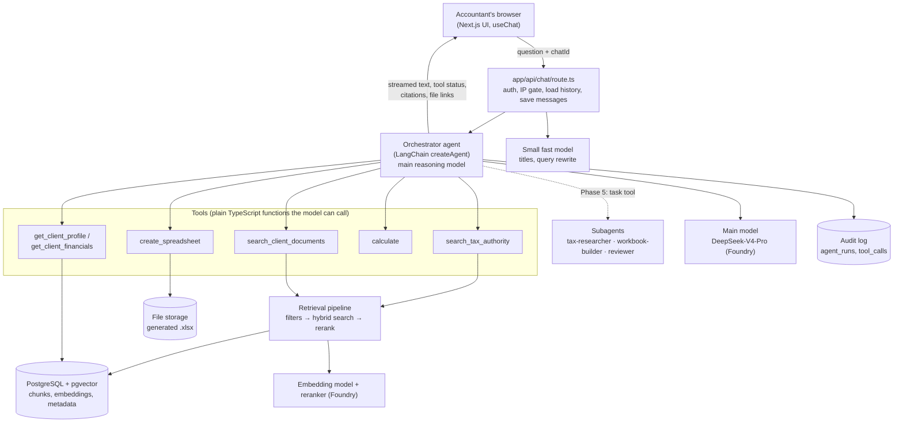

# 01 — Overview: the big picture

[← Back to README](./README.md)

## Who uses it and what they ask

The user is an **accountant** (signed in through Auth0, from an allowed IP). Their questions fall into four kinds, and the architecture is shaped around them:

| Kind | Example | What the AI needs |
|---|---|---|
| **General tax / accounting research** | "What's the 2026 Section 179 limit and the phase-out threshold?" | Search the tax-law knowledge base; cite the sources |
| **Client-specific** | "Can Acme Corp deduct the equipment it bought in March?" | Look up Acme's data (with permission checks) **plus** tax-law search |
| **Calculation** | "What's the depreciation on a $48,000 vehicle over 5 years, MACRS half-year?" | A calculation tool, so numbers are exact |
| **Deliverable** | "Build me a depreciation schedule for Acme's fixed assets in Excel." | Client data + calculations + the spreadsheet tool, returning a downloadable file |

Plain chit-chat ("thanks!", "rephrase that more formally") needs none of these.

## The architecture in one picture



## The layers, from top to bottom

Think of it as seven layers. Each one has a single job, so you can change one without rewriting the others.

1. **UI (browser).** Chat list, chat bubbles, and three new kinds of display: *tool status chips* ("Searching federal tax law…"), *source cards* (citations the answer used), and *file cards* (download the generated .xlsx). Built with AI Elements + shadcn, fed by the AI SDK's `useChat`.
2. **API / gatekeeping** (`app/api/chat/route.ts`, `proxy.ts`). Checks the IP allowlist and the session, validates the request, loads chat history from Postgres, saves the user message, starts the agent, saves the assistant message when it finishes. The route contains **no AI logic** beyond calling the agent.
3. **Agent runtime** (`lib/ai/agent.ts`). The orchestrator: a model in a loop that can call tools. Its instructions (system prompt), its tool list, and its middleware (summarization, limits, PII masking) live here. See [02](./02-agent-orchestration.md).
4. **Tools** (`lib/ai/tools/*`). Ordinary functions with a name, a description, and a zod input schema. This is where the real work and **all permission checks** happen.
5. **Knowledge & data.** Postgres holds three things: (a) chunks of tax law and firm documents with embeddings (RAG, see [03](./03-rag-knowledge-base.md)); (b) structured client data such as profiles and trial balances, queried with SQL, not RAG (see [04](./04-client-data-and-security.md)); (c) records of generated files (see [05](./05-excel-generation.md)).
6. **Models** (Microsoft Foundry). Main reasoning model, small fast model, embedding model, reranker. All configured in one file (`lib/ai/models.ts`). See [06](./06-models-and-routing.md).
7. **Observability & evals.** Audit log of every run and tool call; a fixed question set that is scored whenever a prompt, model, or retrieval setting changes.

## Why this shape

- **Tools make the model trustworthy for accounting.** A model alone will guess tax limits from old training data and make arithmetic mistakes. Tools let it *look things up* and *compute*, and let us show *where* each fact came from.
- **One agent keeps it simple.** Every extra agent is another prompt to maintain, another place for errors, and more tokens (cost + latency). A single agent with 5–8 well-described tools is the right starting point.
- **Layers keep it swappable.** Changing DeepSeek for another model only touches `lib/ai/models.ts`. Moving from pgvector to Azure AI Search only touches the retrieval pipeline. Adding deep agents replaces `lib/ai/agent.ts` while the tools stay the same.

## Answers to the two direct questions

**"Should I use multiple models — one coordinator and others for subtasks?"**
Eventually, partly. Start with **one reasoning model as the coordinator** plus *supporting* models that aren't agents at all (embedding, reranker, a small model for chores). Add subagents in Phase 5, for long research and big workbooks, where their main benefit is keeping the coordinator's context window clean. Details: [02](./02-agent-orchestration.md) and [06](./06-models-and-routing.md).

**"Does Excel generation need a subagent?"**
No, not at first. It's a **tool** the coordinator calls with a structured description of the workbook; code builds the file. A subagent only helps for large, multi-step workbooks. Details: [05](./05-excel-generation.md).

## Proposed code layout

```
lib/ai/
  models.ts              # every model the app uses, by role: main, fast, embed, rerank
  agent.ts               # builds the orchestrator (createAgent now, createDeepAgent later)
  prompts/
    system.ts            # orchestrator instructions (answer contract, citation rules)
    subagents/*.ts       # Phase 5
  tools/
    index.ts             # makeTools(user) — builds tools bound to the signed-in user
    search-tax-authority.ts
    search-client-documents.ts
    client-data.ts
    calculate.ts
    create-spreadsheet.ts
  rag/
    ingest/              # parse → chunk → embed → store (scripts + upload handler)
    retrieve.ts          # filters → hybrid search → rerank
    embed.ts
  excel/
    spec.ts              # zod schema for a workbook spec
    build.ts             # ExcelJS: spec → .xlsx bytes
  middleware/            # custom middleware (SSN/EIN masking, audit logging)
app/api/
  chat/route.ts          # thin: auth, history, run agent, stream, save
  files/[id]/route.ts    # download a generated file (ownership check)
  documents/route.ts     # Phase 4: client document upload → ingestion
db/schema/               # Drizzle tables for the above
scripts/ingest-*.ts      # one-off/scheduled corpus ingestion
evals/                   # question sets + scoring script
```
