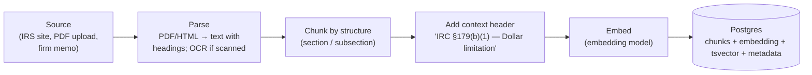
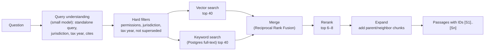

# 03 — RAG and the knowledge base

[← Back to README](./README.md)

## Why RAG

A model only knows what was in its training data, which is months or years old and has no idea which tax year you mean. Tax law changes every year (limits, thresholds, phase-outs, new credits). **RAG** (Retrieval-Augmented Generation) fixes this: before answering, we search *our own* up-to-date documents, put the best passages into the model's context, and require it to answer from them and cite them.

## First rule: text goes to RAG, numbers go to SQL

| Kind of information | Example | How the AI gets it |
|---|---|---|
| **Unstructured text** | IRC sections, Treasury regulations, IRS publications, firm memos, a client's engagement letter | **RAG** (embeddings + search) |
| **Structured data** | Client profile, trial balance, fixed-asset register, prior-year figures | **SQL tools** (`get_client_financials`), see [04](./04-client-data-and-security.md) |

Never embed a trial balance or a spreadsheet as text chunks. Search by "meaning" is fuzzy; accounting numbers must be exact.

## Knowledge collections

| Collection | Contents | Who can see it | Phase |
|---|---|---|---|
| `tax_authority` | Federal: Internal Revenue Code, Treasury Regulations, Revenue Rulings/Procedures, IRS Publications and form instructions. State codes and guidance as needed | All users | 3 |
| `firm_knowledge` | Internal memos, checklists, procedures, templates | All users of the firm | 3–4 |
| `client_documents` | Uploaded client docs: prior returns, statements, contracts, letters | Only users with access to that client | 4 |

**Licensing note:** IRS and federal materials are public. Commercial tax research libraries (CCH, Thomson Reuters Checkpoint, Bloomberg Tax, etc.) are licensed; don't ingest them without a license that allows it.

### Metadata every chunk carries

This metadata is what makes the answers correct for accountants. Filters use it **before** any similarity search.

| Field | Example | Why |
|---|---|---|
| `jurisdiction` | `US-FED`, `US-CA` | Federal and state rules differ |
| `tax_year_start` / `tax_year_end` | 2026 / 2026 (or null = still in force) | Answer for the year asked; accountants also work on prior years and amendments |
| `authority_level` | `statute` > `regulation` > `revenue_ruling` > `irs_publication` > `firm_memo` | Prefer the most authoritative source; show it in citations |
| `citation` | `IRC §179(b)(1)`, `Pub 946 ch.2` | Exact lookups and readable citations |
| `superseded_by` | chunk/document id or null | Exclude outdated guidance by default |
| `client_id` | uuid or null | Permission filter for client documents |
| `source_url`, `title`, `section_path` | | Source cards in the UI |

## Ingestion pipeline (getting documents in)



Step details:

1. **Parse.** Keep the document's structure (headings, section numbers, tables). Legal text is organized by section; losing that makes retrieval much worse. Scanned PDFs need OCR.
2. **Chunk by structure, not by character count.** One chunk ≈ one subsection, typically 300–1,000 tokens. Split long sections with ~10–15% overlap; keep tables whole where possible.
3. **Context header.** Prepend the document title and section path to every chunk before embedding ("Pub 946 (2026) › Chapter 2 › Dollar Limits"). A chunk that just says "the limit is reduced by…" is useless without it.
4. **Embed** in batches with the embedding model (see [06](./06-models-and-routing.md)).
5. **Store** with a content hash (skip unchanged chunks on re-ingest) and a `document_version`.
6. **Versioning.** A new tax year's publication is a **new** document with new year metadata. Never overwrite or delete prior years.

Where ingestion runs: public corpora via `scripts/ingest-*.ts` (run manually or on a schedule); client uploads via `app/api/documents` → a background job (parsing a 200-page PDF shouldn't block a web request).

## Database tables (sketch)

```sql
-- requires: CREATE EXTENSION vector;
create table knowledge_documents (
  id uuid primary key,
  collection text not null,            -- tax_authority | firm_knowledge | client_documents
  title text not null,
  citation text,
  jurisdiction text,
  authority_level text,
  tax_year_start int, tax_year_end int,
  client_id uuid references clients(id),  -- null unless client document
  source_url text,
  version int not null default 1,
  superseded_by uuid references knowledge_documents(id),
  content_hash text not null,
  created_at timestamptz default now()
);

create table knowledge_chunks (
  id uuid primary key,
  document_id uuid not null references knowledge_documents(id) on delete cascade,
  section_path text,                   -- "§179 › (b) › (1)"
  content text not null,               -- chunk text incl. context header
  tokens int,
  embedding vector(1536),              -- see note on dimensions
  search_tsv tsvector generated always as (to_tsvector('english', content)) stored
  -- plus copies of the filter fields (jurisdiction, tax years, client_id...) for fast filtering
);
create index on knowledge_chunks using hnsw (embedding vector_cosine_ops);
create index on knowledge_chunks using gin (search_tsv);
```

**Dimensions note:** pgvector's HNSW index supports up to 2,000 dimensions for the `vector` type (4,000 for `halfvec`). `text-embedding-3-large` produces 3,072 by default, so either request `dimensions: 1536` from the API or store `halfvec(3072)`. Pick one and keep it; changing it means re-embedding everything.

Drizzle ORM supports the `vector` column type and pgvector distance helpers; define these tables in `db/schema/`.

## Retrieval pipeline (getting the right passages out)



1. **Query understanding.** "What about the car?" is useless as a search. The small model rewrites it into a standalone query using the conversation ("Section 280F luxury auto depreciation limits 2026") and extracts filters: jurisdiction, tax year, entity type, any explicit citations.
2. **Exact citation shortcut.** If the question names a cite ("§179", "Form 4562 instructions"), fetch it directly with `lookup_citation` as well.
3. **Hard filters first.** Permissions (`client_id` must be one the user can access), jurisdiction, tax year, `superseded_by is null`. These are SQL `WHERE` clauses, not suggestions to the model.
4. **Hybrid search.** Vector search finds passages with similar *meaning*; keyword search finds exact terms like "§1031", "Form 8829", "QBI". Tax work needs both.
5. **Merge with Reciprocal Rank Fusion (RRF).** A simple formula that combines the two ranked lists: items near the top of either list score well.
6. **Rerank.** A reranker model scores each (question, passage) pair and keeps the best 6–8.
7. **Expand.** Add the parent section or neighboring chunks when a passage is cut mid-thought.
8. **Return** passages with short IDs and metadata. The model cites `[S1]`; the UI turns IDs into source cards.

"Agentic RAG": because search is a *tool*, the agent can search again with a better query if the first results were weak, or search federal and state separately. At L3 the `tax-researcher` subagent does many such searches and returns a memo.

## Answer contract (enforced by the system prompt and checked by evals)

- Every rule, limit, or threshold is followed by a citation `[S#]`.
- The answer states the jurisdiction and tax year it applies to.
- If retrieved sources conflict, prefer the higher `authority_level` and say there's a conflict.
- If nothing relevant was retrieved: "I couldn't find authority for this in the knowledge base," rather than answering from memory.

## Why pgvector (and when to switch)

- We already run PostgreSQL. One database means permission filters, joins to clients, and transactions all work with ordinary SQL.
- Postgres full-text search gives us keyword search for hybrid retrieval with no extra service.
- It comfortably handles the size of a tax corpus (hundreds of thousands to low millions of chunks).
- **Revisit** (e.g. Azure AI Search, which has built-in hybrid search and semantic ranking) if we go past ~10M chunks, need managed scaling, or retrieval quality plateaus. The retrieval pipeline is isolated in `lib/ai/rag/retrieve.ts` so this is a contained change.

## Keeping it fresh

- Re-ingest sources on a schedule and when new-year publications are released.
- Track per document: `ingested_at`, source version/date. Show it on source cards ("Pub 946, 2026 edition").
- Evals ([06](./06-models-and-routing.md)) include "did retrieval return the right section?" so ingestion changes can't silently break answers.
