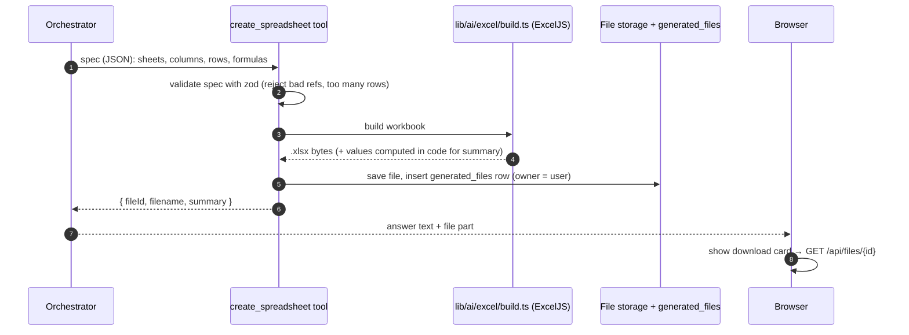

# 05 — Excel generation (and reading spreadsheets)

[← Back to README](./README.md)

## Decision: a tool first, a subagent later

**Generating an Excel file is a tool, not a subagent.** Split the work by what each side is good at:

- **The model** decides *what* the workbook should contain: sheets, columns, rows, which cells are formulas. It outputs this as a structured JSON **spec**.
- **Our code** turns the spec into a real `.xlsx` file with ExcelJS: formatting, number formats, formulas, column widths, frozen header rows. This part is deterministic and never "hallucinates".

A subagent only earns its place for big jobs (see "When to upgrade" below).

## Flow



The download route `app/api/files/[id]/route.ts` checks that the signed-in user owns the file (or has access to its client) before streaming it with the xlsx content type.

## The spec (sketch)

```ts
// lib/ai/excel/spec.ts — illustrative
const Cell = z.union([
  z.string(),
  z.number(),
  z.null(),
  z.object({ formula: z.string().max(500) }),        // e.g. { formula: "B2*C2" }
]);

export const WorkbookSpec = z.object({
  filename: z.string().regex(/^[\w\- ]{1,80}\.xlsx$/),
  sheets: z.array(z.object({
    name: z.string().max(31),                          // Excel's sheet-name limit
    columns: z.array(z.object({
      header: z.string(),
      width: z.number().optional(),
      format: z.enum(["text", "currency", "percent", "date", "integer", "decimal"]).optional(),
    })).max(50),
    rows: z.array(z.array(Cell)).max(5000),
    totals: z.array(z.object({ column: z.number(), fn: z.enum(["SUM", "AVERAGE"]) })).optional(),
    freezeHeader: z.boolean().default(true),
  })).min(1).max(10),
});
```

## Rules

- **Use real Excel formulas** (`=SUM(D2:D40)`, `=B2*C2`) so accountants can audit and edit the workbook. A sheet of pasted numbers can't be checked.
- **Also compute the key values in code** (with the same logic as `calculate`) so the chat answer can quote totals without trusting the model's arithmetic. Set `workbook.calcProperties.fullCalcOnLoad = true` so Excel recalculates when the file opens.
- **Data comes from tools, not from the model's memory.** For client workbooks, the tool should accept a *reference* to data (e.g. `{ source: "fixed_assets", clientId }`) and fetch rows itself, instead of having the model copy hundreds of numbers through its output (slow, expensive, error-prone).
- **Templates for common deliverables.** For recurring outputs (Section 179 worksheet, depreciation schedule, account reconciliation), keep firm-approved `.xlsx` templates with named ranges; a `fill_template` tool fills them in. More reliable and more consistent than building from scratch every time.
- **Safe files only.** No macros (`.xlsm`), no external links, no hyperlinks to unknown URLs. Formula strings are validated (allowlist of functions; no `WEBSERVICE`, `HYPERLINK` to external sites, etc.).
- **Library:** ExcelJS (MIT license; supports styles, number formats, formulas, and reading files).

## When to upgrade to a `workbook-builder` subagent (Phase 5)

Add the subagent when workbooks need **multiple steps with lots of data**, for example:

- a depreciation schedule for 300 assets from an uploaded fixed-asset register, with a summary sheet and a tie-out to the trial balance;
- a multi-sheet tax provision workpaper pulling from several tools.

Why a subagent helps there: the builder can fetch data, compute, build, **re-open and check** its own workbook (`inspect_spreadsheet`), and fix mistakes, all in its own context. Only `{ fileId, summary }` comes back to the orchestrator, so the conversation isn't flooded with hundreds of rows.

## Reading spreadsheets the user uploads

1. Upload → store the original in `uploaded_files`.
2. Parse with ExcelJS into a normalized table (detect the header row, types, sheet names).
3. Save rows as structured data (e.g. into `client_financials` / `fixed_assets` after the user confirms the column mapping, or a generic `uploaded_table_rows` table).
4. The agent queries it with `read_uploaded_table` (filters, limits), never by pasting the whole sheet into the prompt.
